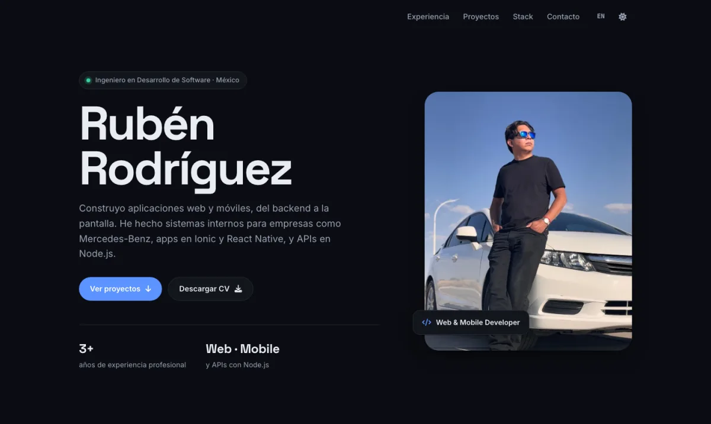

# Hola, soy Rubén 👋

**Ingeniero en Desarrollo de Software** en México. Construyo aplicaciones web y móviles, del backend a la pantalla.

- 💼 Desarrollador web en **QMC MEX**: sistemas de gestión de cursos para Mercedes-Benz (EE. UU. y México)
- 🚚 Freelance: sitio corporativo de [Transportes Mixtos Miranda](https://transmiranda.com)
- 📱 Apps móviles con Ionic y React Native · APIs con Node.js

🌐 **Portafolio:** [ruben-rodriguez.netlify.app](https://ruben-rodriguez.netlify.app/)

## 🛠 Stack

  <a href="https://ruben-rodriguez.netlify.app/#stack">
    <picture>
      <source media="(prefers-color-scheme: dark)" srcset="https://skillicons.dev/icons?i=react%2Cangular%2Cts%2Cjs%2Cvite%2Cnodejs%2Cexpress%2Cphp%2Cpython%2Cmongodb%2Cmysql%2Cfirebase%2Cgit%2Clinux&theme=dark&perline=8" />
      
    </picture>
  </a>

Mobile: **Ionic · React Native · Capacitor**

## 🚀 Proyectos destacados

| Proyecto | Qué es | Stack |
| :-- | :-- | :-- |
| [**Transportes Mixtos Miranda**](https://transmiranda.com) | Sitio corporativo para una empresa de transporte de carga: desarrollo, hosting, SEO y analítica | React · Vite · PHP |
| [**QR Check-In / Out**](https://github.com/RubsRz/QR-Check-In-Out-Tracker) | App móvil para registrar entradas y salidas de personal con códigos QR | Ionic · Angular · Capacitor |
| [**Transportistas API**](https://github.com/RubsRz/ApiTransportistas) | Backend de una app móvil para asignar vehículos a conductores, con pruebas en Jest | Node.js · Express · MongoDB |
| [**Generador de diplomas PDF**](https://github.com/RubsRz/PDF-Generator-using-Puppeteer) | Genera certificados en PDF a partir de una plantilla HTML | Node.js · Puppeteer |

## 📫 Contacto

 

<picture>
  <source media="(prefers-color-scheme: dark)" srcset="https://raw.githubusercontent.com/RubsRz/RubsRz/output/github-snake-dark.svg" />
  
</picture>
